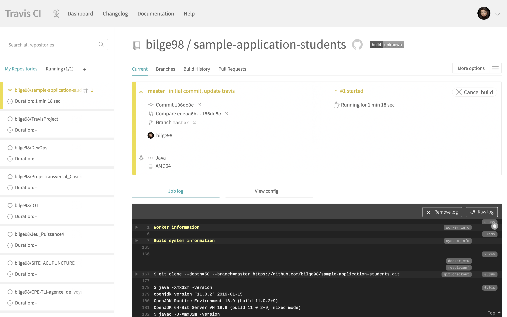

# DevOps

## Module DevOps S8 - TP2 - Travis CI 

* On fork le projet sample-application

* Création de .travis.yml
```
language: java
 
script: 
    - mvn clean verify
```
* Après avoir setup Travis, et mis en place le repo Git on stage nos modifs sur le projet et on les commit, puis les push sur github : 
```
 git add .
 git commit -m 'initial commit'
 git push
```
 
* On observe dans Travis CI qu'un job a été lancé, directement à partir de notre fichier .travis.yml mis à jour après commit



* Le log nous montre que le mvn-clean-verify a été correctement terminé et que les tests ont été réalisés avec succès


* Dans travis CI, lorsqu'on saisit notre docker_username et notre password, il est enregistré en "sécurisé" et en masqué car ces informations risqueraient d'être affichées dans le log

* On crée deux dockerfiles, un pour chaque projet

* Sachant que l'on veut le .jar, c'est ce dernier que l'on place en entrypoint pour chaque dockerfile que voici

Dockerfile api
```
   FROM openjdk:11-jre
   ENV MYAPP_HOME /opt/api
   WORKDIR $MYAPP_HOME
   COPY /target/*-exec.jar $MYAPP_HOME/api.jar

   ENTRYPOINT java -jar api.jar
```

Dockerfile db
```
   FROM openjdk:11-jre
   ENV MYAPP_HOME /opt/db
   WORKDIR $MYAPP_HOME
   COPY /target/*-exec.jar $MYAPP_HOME/db.jar

   ENTRYPOINT java -jar db.jar
```

* Le contenu du fichier .travis.yml est modifié puisque l'on souhaite utiliser docker , on y ajoute la construction des images, la connexion au hub (avec création de variables d'envrionnement pour préserver login et mdp), et le push sur hubdocker de nos projets: 
```
   language: java

   services:
      - docker

   #env:
   #    - DOCKER_COMPOSE_VERSION=1.4.2

   script: 
       - mvn clean verify
       - mvn package -DskipTests
       #build
       - docker build -t bilge98/sample-application-db-changelog-job sample-application-db-changelog-job/
       - docker build -t bilge98/sample-application-http-api-server/http sample-application-http-api-server/
       #connexion
       - docker login --username=$DOCKER_USERNAME --password=$PASSWORD
       #push
       - docker push bilge98/sample-application-db-changelog-job
       - docker push bilge98/sample-application-http-api-server 
```

Maven sert à gérer les dépendances et donc la compilation des projets.

* Une fois les job Travis effectués, on s'occupe des tests de qualité avec SonarCloud, lié à notre github
On ajoute à .travis.yml
```
  addons:
   sonarcloud:
    organization: "bilge98"
    token:
     secure: $tokensonar
```

Au final on a:
```
   language: java

   stages:
    - build_maven
    - build_docker
    - deploy_docker

   addons:
    sonarcloud:
     organization: "bilge98"
     token:
      secure: $tokensonar

   jobs:
    include:
     - stage: build_maven
      name: "lancement du build"
      script: mvn clean org.jacoco:jacoco-maven-plugin:prepare-agent verify sonar:sonar -Dsonar:projectKey=zsmr-application-students
     - stage: build_docker
      name: "build docker"
      script: 
       - docker build -t bilge98/sample-application-db-changelog-job sample-application-db-changelog-job
       - docker build -t bilge98/sample-application-http-api-server/http sample-application-http-api-server
     - stage: deploy_docker
      name: "Deploy docker + push"
      script: 
       - docker login --username=$usrname --password=$pwd
       - docker push bilge98/sample-application-db-changelog-job
       - docker push bilge98/sample-application-http-api-server
```

* On crée .sonarcloud.properties à la racine du projet

* On sélectionne notre repo projet et on lance l'analyse.

