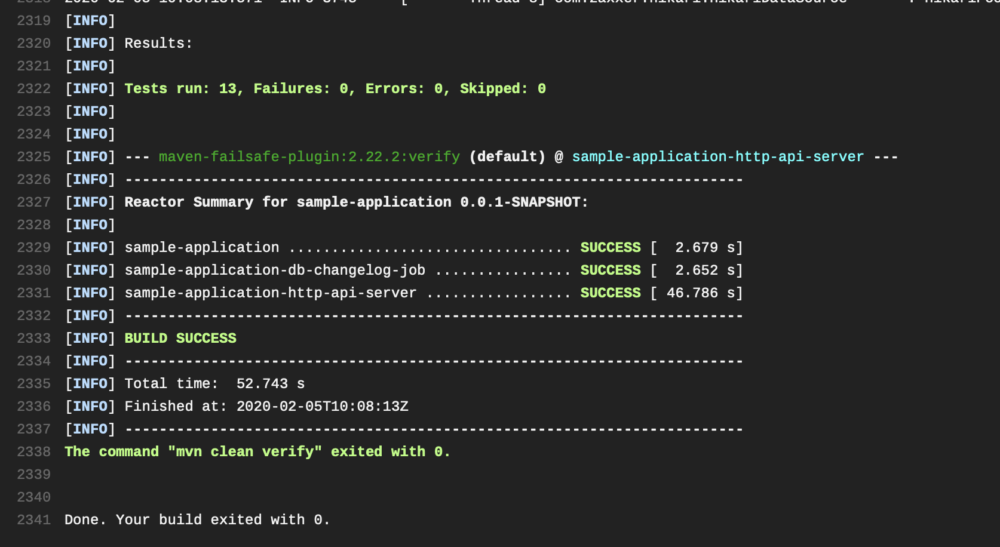

# DevOps

## Module DevOps S8 - TP2 - Travis CI 

* On fork le projet sample-application

* Création de .travis.yml
```
language: java
 
script: 
    - mvn clean verify
```
* Après avoir setup Travis et mis en place le repo Git, on observe dans Travis CI qu'un job a été lancé, directement à partir de notre fichier .travis.yml 


* Le log nous montre que le mvn-clean-verify a été correctement terminé et que les tests ont été réalisés avec succès




* Dans travis CI, lorsqu'on saisit notre docker_username et notre password, il est enregistré en "sécurisé" et en masqué car ces informations risqueraient d'être affichées dans le log

* Le contenu du fichier .travis.yml est modifié puisque l'on souhaite utiliser docker : 
```
   language: java

   services:
      - docker

   #env:
   #    - DOCKER_COMPOSE_VERSION=1.4.2

   script: 
       - mvn clean verify
       - mvn package -DskipTests
       #build
       - docker build -t bilge98/sample-application-db-changelog-job sample-application-db-changelog-job/
       - docker build -t bilge98/sample-application-http-api-server/http sample-application-http-api-server/
       #connexion
       - docker login --username=$DOCKER_USERNAME --password=$PASSWORD
       #push
       - docker push bilge98/sample-application-db-changelog-job
       - docker push bilge98/sample-application-http-api-server 
```

* Le contenu de nos dockerfiles créés 
```
   FROM openjdk:11-jre
   ENV MYAPP_HOME /opt/api
   WORKDIR $MYAPP_HOME
   COPY /target/*-exec.jar $MYAPP_HOME/api.jar

   ENTRYPOINT java -jar api.jar
```

```
   FROM openjdk:11-jre
   ENV MYAPP_HOME /opt/db
   WORKDIR $MYAPP_HOME
   COPY /target/*-exec.jar $MYAPP_HOME/db.jar

   ENTRYPOINT java -jar db.jar
```

Maven s'occupe de toutes les dépendences et Travis de la compilation avec l'aide de Maven

* Une fois les job Travis effectués, on s'occupe des tests de qualité avec SonarCloud

